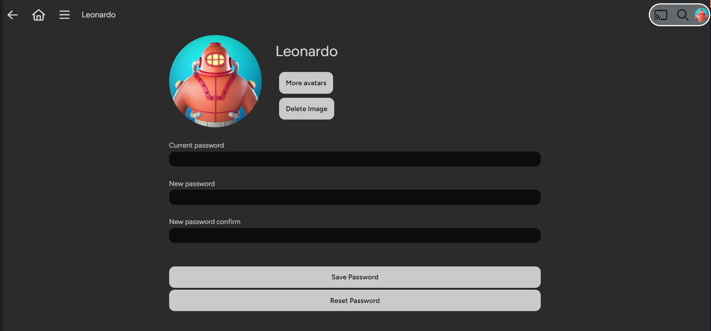
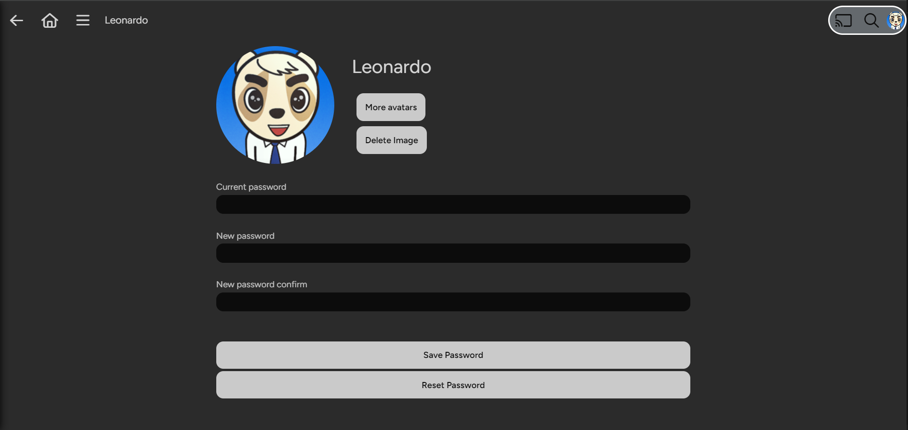
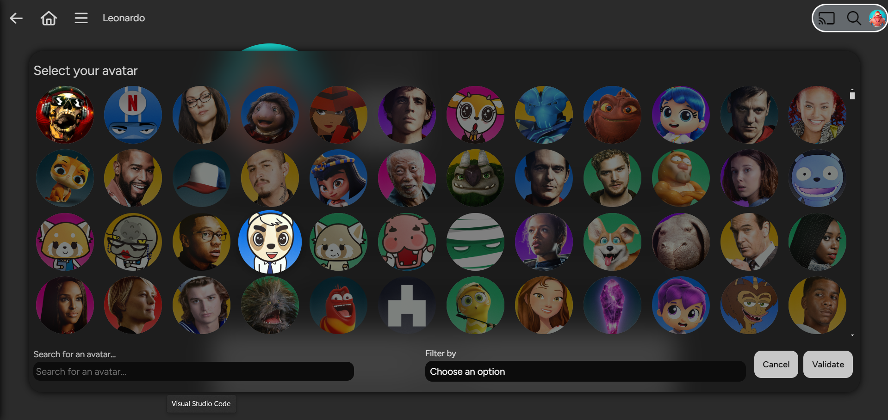
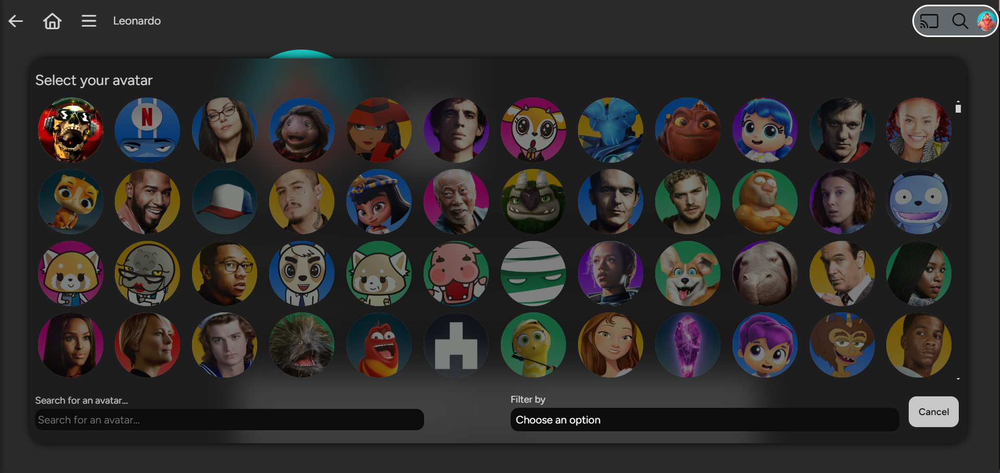
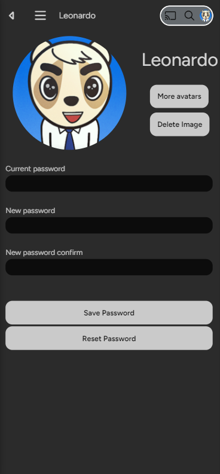
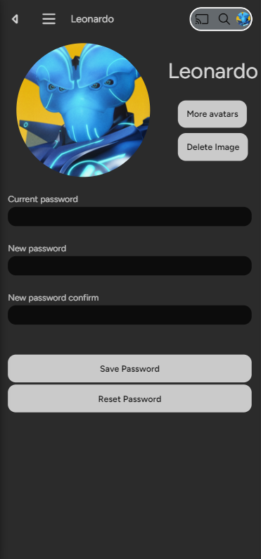
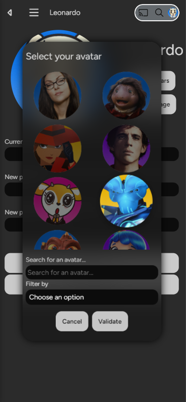
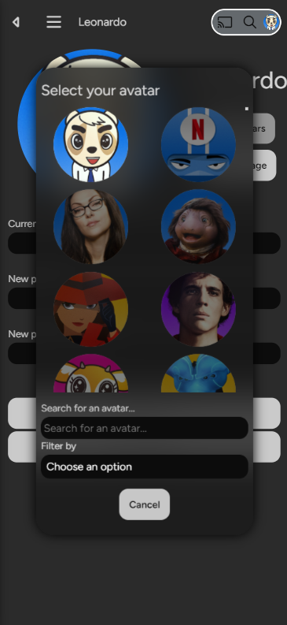

# jf-avatars

## Description

**jf-avatars** is a JavaScript application designed to allow users to select avatars from an image gallery in a **Jellyfin** compatible environment. The application provides a user-friendly interface via a custom modal, facilitating the selection of profile images from an organized collection.

## Acknowledgments

A big thank you to [BobHasNoSoul](https://github.com/BobHasNoSoul/jellyfin-avatars.git) for the inspiration and for sharing the images used in this project.

## Features

- **Avatar Selection**: An intuitive interface for browsing and choosing avatars from an image gallery.
- **Responsive Image Grid**: Display of images in a grid format, adapted to all screen sizes.
- **Search and Filter**: Image search functionality by name and filtering by category through a dropdown menu.
- **Visual State Management**: Selected images are displayed in color while unselected ones appear in grayscale.
- **Internationalization**: Support for language customization via CSS variables.
- **Integration with Jellyfin**: Seamlessly integrates with Jellyfin themes, providing a cohesive experience.


## Screenshots

Here are some screenshots demonstrating the functionality and UI of the **jf-avatars** project across different devices.

### Desktop View

- **Show Modal Button**  
  
  
- **Modal Open (Closed)**  
  
  
- **Modal Open (Selected)**  
  
  
- **Full Modal View**  
  

### Mobile View

- **Show Modal Button**  
  

- **Modal Open (Closed)**  
  

- **Modal Open (Selected)**  
  

- **Full Modal View**  
  


## Project Structure

The project is structured as follows:

- **index.js**: Entry point for initializing the application and injecting the modal.
- **constants.js**: Contains global constants (sections, images) used in the application.
- **events.js**: Event handlers for user interactions (searching, filtering).
- **props.js**: Dynamic properties and application state (selected image).
- **style.js**: Functions to adjust the modal's style based on screen size.
- **ui-elements.js**: Generation of user interface elements (buttons, dropdown, image grid).

## Usage

### Injecting the Script

You can integrate the script into your project in two ways:

1. **Direct Injection in `index.html`**:

   ```html
   <script
     type="module"
     src="https://github.com/kalibrado/jf-avatars/releases/download/{version}/main.js"
     defer
   ></script>
   ```

2. **Injection via Nginx**:

   ```nginx
   location / {
       proxy_pass http://backend_server;  # Reverse proxy to your backend
       sub_filter '</body>' '<script type="module" src="https://github.com/kalibrado/jf-avatars/releases/download/{version}/main.js" defer></script></body>';
       sub_filter_once on;  # Apply the modification only once
   }
   ```

### General Functioning

- **Loading the Avatar Selection Modal**: Checks for the presence of the `#btnDeleteImage` button, creates a new button to open the modal.
- **Image Selection**: Click on an image to select it. Selected images are colored, while unselected ones are in grayscale.
- **Image Search**: Use the search bar to locate specific images by name.
- **Category Filtering**: Select a category from the dropdown to filter images.

### Language Management via CSS

The texts in the interface can be customized using CSS variables, allowing for easy management of internationalization:

```css
:root {
  --jf-avatars-title: "Select your avatar";
  --jf-avatars-filter-label: "Filter by";
  --jf-avatars-search-label: "Search for an avatar...";
  --jf-avatars-btn-cancel: "Cancel";
  --jf-avatars-btn-validate: "Validate";
}
```

The values are dynamically retrieved in the JavaScript to adapt to language preferences.

### Integration with the Jellyfin Theme

Each element created by the script is designed to integrate with the Jellyfin theme, ensuring a seamless user experience, even with custom themes.

### Image Naming Specifications

Images must follow a specific naming scheme: `FolderName-image_name.png`. They should be organized in the `src/img` folder, sorted by theme.

## Documentation with JSDoc

The project is fully documented using JSDoc. To generate the documentation from the source code, run the following command:

```bash
npm run docs
```

This will create comprehensive documentation in a `docs` directory.

## License

This project is licensed under the MIT License. See the [LICENSE](LICENSE) file for more details.
