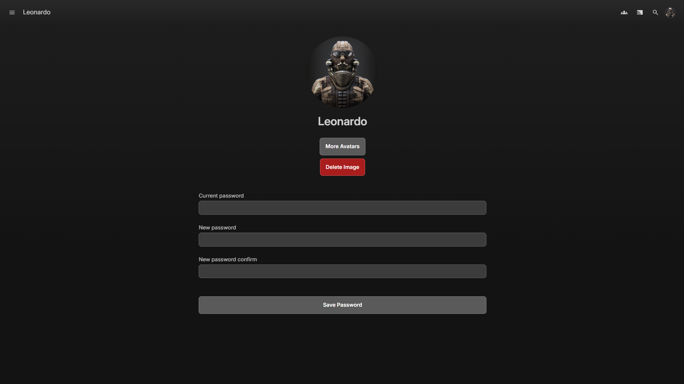
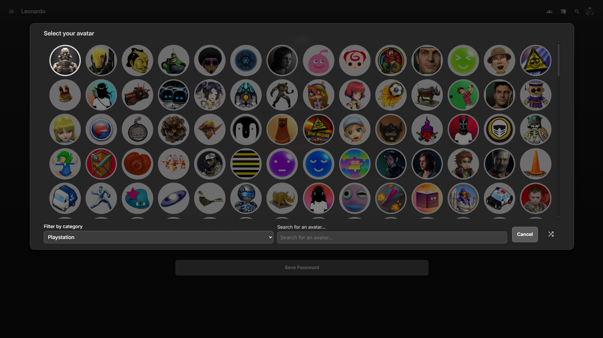
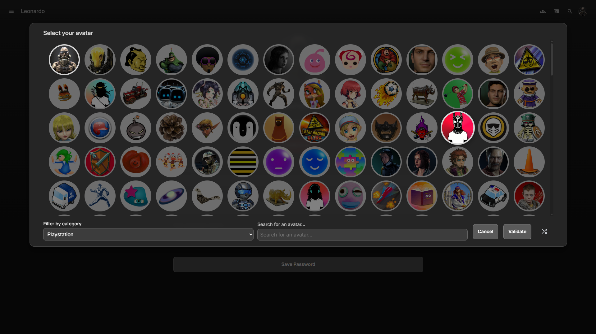
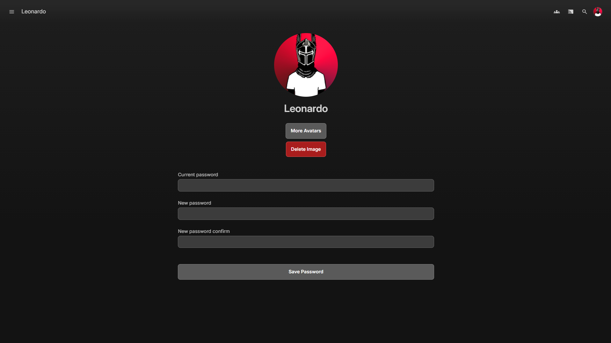
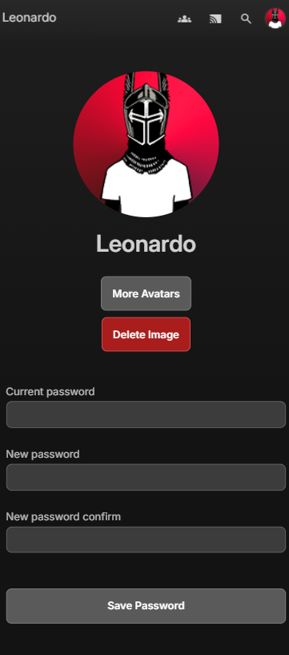
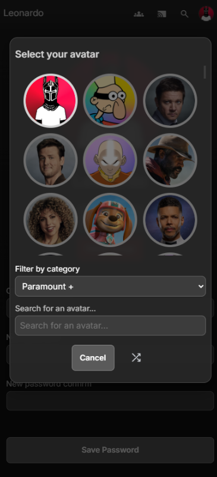
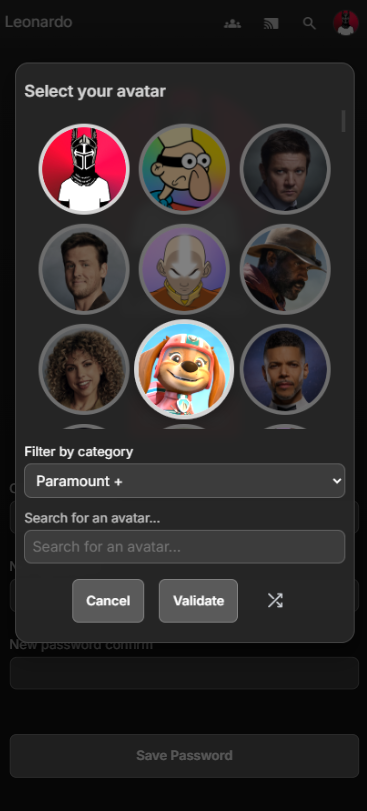
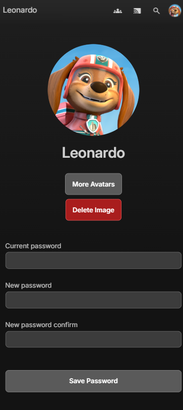

# jf-avatars


## Description

**jf-avatars** is a JavaScript library that allows users to select avatars from an image gallery in a **Jellyfin** compatible environment. The application provides a user-friendly interface via a custom modal, facilitating the selection of profile images from an organized collection.

## 🚀 Getting Started

The easiest and recommended way to install **jf-avatars** is through the **Jellyfin JavaScript Injector** plugin.

### Quick Installation

1. Install the **Jellyfin JavaScript Injector** plugin:
   <https://github.com/n00bcodr/Jellyfin-JavaScript-Injector>

2. Restart Jellyfin.

3. Navigate to:

```text
Dashboard → Plugins → JavaScript Injector
```

1. Create a new script:

**Name**

```text
JF-AVATARS
```

**Script**

```javascript
(() => {
  const CONFIG = {
    primary: "https://cdn.jsdelivr.net/gh/kalibrado/jf-avatars@latest/main.js",
    fallback: "https://raw.githubusercontent.com/kalibrado/jf-avatars/main/main.js",
    timeout: 8000,
    retries: 2,
  };

  console.log("[JF-AVATARS] injector booting...");

  function loadScript(url, attempt = 0) {
    return new Promise((resolve, reject) => {
      const script = document.createElement("script");
      script.type = "module";
      script.defer = true;
      script.src = url;

      const timer = setTimeout(() => {
        script.remove();
        reject(new Error("Timeout loading: " + url));
      }, CONFIG.timeout);

      script.onload = () => {
        clearTimeout(timer);
        console.log("[JF-AVATARS] loaded:", url);
        resolve();
      };

      script.onerror = () => {
        clearTimeout(timer);
        script.remove();
        reject(new Error("Failed loading: " + url));
      };

      document.head.appendChild(script);
    }).catch(async (err) => {
      console.warn("[JF-AVATARS] error:", err.message);

      if (attempt < CONFIG.retries) {
        console.log(`[JF-AVATARS] retry ${attempt + 1}/${CONFIG.retries}`);
        return loadScript(url, attempt + 1);
      }

      throw err;
    });
  }

  function init() {
    const start = async () => {
      try {
        await loadScript(CONFIG.primary);
      } catch (e) {
        console.warn("[JF-AVATARS] primary failed, fallback...");
        try {
          await loadScript(CONFIG.fallback);
        } catch (e2) {
          console.error("[JF-AVATARS] all sources failed:", e2);
        }
      }
    };

    if (document.readyState === "complete") {
      start();
    } else {
      window.addEventListener("load", start);
    }
  }

  init();
})();
```

1. Save the script.

2. Navigate to:

```text
Dashboard → Scheduled Tasks
```

1. Run:

```text
JavaScript Injector Startup
```

1. Refresh Jellyfin and open your profile settings.

The Avatar Gallery button should now be available.

## 📦 Repositories

🔹 **Main Script Repository**  
📁 [`jf-avatars`](https://github.com/kalibrado/jf-avatars)  
[](https://github.com/kalibrado/jf-avatars/stargazers)
[](https://github.com/kalibrado/jf-avatars/network)
[](https://github.com/kalibrado/jf-avatars/blob/main/LICENSE)

🔹 **Image Collection Repository**  
🖼️ [`jf-avatars-images`](https://github.com/kalibrado/jf-avatars-images)  
[](https://github.com/kalibrado/jf-avatars-images/stargazers)
[](https://github.com/kalibrado/jf-avatars-images/network)
[](https://github.com/kalibrado/jf-avatars-images/blob/main/LICENSE)

## ✨ Features

- **Avatar Selection**: Intuitive interface for browsing and choosing avatars from an image gallery.
- **Responsive Image Grid**: Displays images in a grid format, adapted to all screen sizes.
- **Search and Filter**: Image search functionality by name and filtering by category through a dropdown menu.
- **Visual State Management**: Selected images are displayed in color while unselected ones appear in grayscale.
- **Internationalization**: Automatic language detection without needing CSS. The application dynamically loads the correct language based on the user's preferences.
- **Integration with Jellyfin**: Seamlessly integrates with Jellyfin themes, providing a cohesive experience.

### 🌐 Available Languages

The application currently supports the following languages:

| Flag | Language   | Code |
| ---- | ---------- | ---- |
| 🇬🇧    | English    | `en` |
| 🇪🇸    | Spanish    | `es` |
| 🇫🇷    | French     | `fr` |
| 🇮🇹    | Italian    | `it` |
| 🇵🇹    | Portuguese | `pt` |
| 🇹🇷    | Turkish    | `tr` |

## 🖼️ Screenshots

Here are some screenshots demonstrating the functionality and UI of the **jf-avatars** project across different devices.

### Desktop View

  
  
  
  

### Mobile View

  
  
  
  

## 🧩 Project Structure

The project is structured as follows:

- **index.js**: Entry point for initializing the application and injecting the modal.
- **events.js**: Event handlers for user interactions (searching, filtering).
- **props.js**: Dynamic properties and application state (selected image).
- **style.js**: Functions to adjust the modal's style based on screen size.
- **ui-elements.js**: Generation of user interface elements (buttons, dropdown, image grid).

### General Functioning

- **Loading the Avatar Selection Modal**: Detects the `#btnDeleteImage` button and adds a new button to open the modal.
- **Image Selection**: Click on an image to select it. Selected images appear in color, while unselected ones are in grayscale.
- **Image Search**: Use the search bar to locate specific images by name.
- **Category Filtering**: Select a category from the dropdown to filter images.

### Advanced Usage Examples

#### Customizing the image source

```javascript
// Set a custom URL for avatar images
document.documentElement.style.setProperty('--jf-avatars-url-images', 'https://my-server.com/my-avatars/images_metadata.json');
```

#### Integration with custom events

```javascript
// Listen for avatar selection event
document.addEventListener('jf-avatars-selected', function(event) {
  console.log('Avatar selected:', event.detail.imageUrl);
  // Perform additional actions...
});
```

### Image Management

The default images come from the repository [jf-avatars-images](https://github.com/kalibrado/jf-avatars-images). This repository maintains an organized collection of avatars.

If users wish to use their own images, they can specify a custom image URL using the CSS property:

```css
--jf-avatars-url-images: "https://your-custom-url.com/path/to/images_metadata.json";
```

To ensure proper functionality, images should follow the naming convention defined in the [images_metadata.json](https://github.com/kalibrado/jf-avatars-images/blob/main/images_metadata.json) file.

### Language Management

The language management is fully automatic and does not require any manual configuration. The correct language is dynamically loaded based on the user's browser preferences.

The application attempts to load the appropriate language file (e.g., `fr.json`, `en.json`) from the local server, and if not found, falls back to a GitHub repository.

### Integration with the Jellyfin Theme

All elements created by the script are designed to integrate seamlessly with Jellyfin's theme, ensuring a smooth user experience, even with custom themes.

## 📚 Documentation with JSDoc

The project is fully documented using JSDoc. To generate the documentation from the source code, run the following command:

```bash
npm run docs
```

This will create comprehensive documentation in a `docs` directory.

## ❓ FAQ

### How can I add a new language?

To add a new language, create a JSON file in the appropriate format and place it in the translations directory. Consult existing files as templates.

### Are custom avatars supported?

Yes! You can use your own avatars by setting the CSS property `--jf-avatars-url-images` to point to your image metadata JSON file.

### Can I use jf-avatars without Jellyfin?

While designed for Jellyfin, the script can be adapted to other web applications by modifying the selectors and events in the source code.

### How do I troubleshoot installation issues?

Check that all paths are correct and file permissions are appropriate. Also ensure that Jellyfin has been restarted after installation.

## 🤝 Contributing

Contributions to this project are welcome! Here's how you can contribute:

1. **Fork** the repository
2. **Create** a branch for your feature (`git checkout -b feature/amazing-feature`)
3. **Commit** your changes (`git commit -m 'Add amazing feature'`)
4. **Push** to the branch (`git push origin feature/amazing-feature`)
5. **Open** a Pull Request

Please read the [CONTRIBUTING.md](CONTRIBUTING.md) file for more details on our code of conduct and the process for submitting Pull Requests.

## 🙏 Acknowledgments

Special thanks to [BobHasNoSoul](https://github.com/BobHasNoSoul/jellyfin-avatars.git) for the inspiration and for sharing the images used in this project.

## 📄 License

This project is licensed under the MIT License. See the [LICENSE](LICENSE) file for more details.
